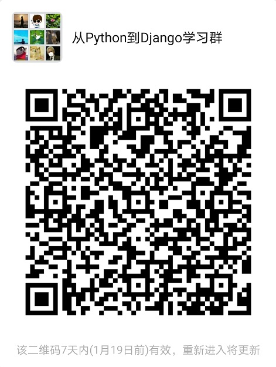

# 从Python到Django入门教程
--------------------------------------------------

## 前言

​Python是一门面向对象的编程语言，它相对于其他语言，更加易学、易读，非常适合快速开发。Python具有简单、易学、免费、开源、可移植、可扩展、可嵌入、面向对象等优点，它的面向对象甚至比java和C#.net更彻底。作为一种通用语言，Python几乎可以用在任何领域和场合，角色几乎是无限的。Python在软件质量控制、提升开发效率、可移植性、组件集成、丰富库支持等各个方面均处于先进地位。学习编程语言，除了拿好现有的饭碗，还要选择学习业内目前最先进、最热门、将来应用最广泛、最有前途和前景的编程语言。有人预言，Python会成为继C++和Java之后的第三个主流编程语言。

Django是一个开放源代码的Web应用框架，由Python写成。采用了MVC的软件设计模式，即模型M，视图V和控制器C。它最初是被开发来用于管理劳伦斯出版集团旗下的一些以新闻内容为主的网站的。并于2005年7月在BSD许可证下发布。这套框架是以比利时的吉普赛爵士吉他手Django Reinhardt来命名的。

Django的主要目标是使得开发复杂的、数据库驱动的网站变得简单。Django注重组件的重用性和“可插拔性”，敏捷开发和DRY法则（Don't Repeat Yourself）。在Django中Python被普遍使用，甚至包括配置文件和数据模型。

在Python各种web框架中，Django的文档最完善、市场占有率最高、招聘职位最多！


本书整理Python和Django的入门教程，给零起点的程序员一个完整的学习路径：

```
  	Python 3.6--->Django 1.11
```

## 开发环境

本文的范例基于Visual Studio Code编辑器完成的。因此，你需要准备以下这些软件：

* [VS Code](https://code.visualstudio.com/)编辑器，还需要安装Python扩展。

* [Python3的安装文件](https://www.python.org/downloads/)，根据你自己的操作系统安装，"下一步&下一步"就能搞定，无需多说。

* 用virtualenv搭建Django的开发环境，后文会详细描述。

## 开始学习

根据自己的情况选择从哪里开始学习，如果你已经有了一定的基础，你可以选择跳过某些章节，对于大多数初学者来讲，学习的路径如下：

### 1. [搭建Python开发环境](https://borisliu.gitbooks.io/from-python-to-django/content/introduction/)
### 2. [简明Python教程](https://borisliu.gitbooks.io/from-python-to-django/content/a-byte-of-python3/)
### 3. [Django Step By Step](https://borisliu.gitbooks.io/from-python-to-django/content/django-step-by-step/)

---


### by <boris_cn@263.net>

### 废话少说，开始吧！

更多关于Python以及Django的讨论，尤其是使用Django开发微信相关应用的技术，请使用微信扫描二维码加群。



本书托管在[GitHub](https://github.com/borisliu/from-python-to-django)，
如果有问题请在线[提交](https://github.com/borisliu/from-python-to-django/issues)。
