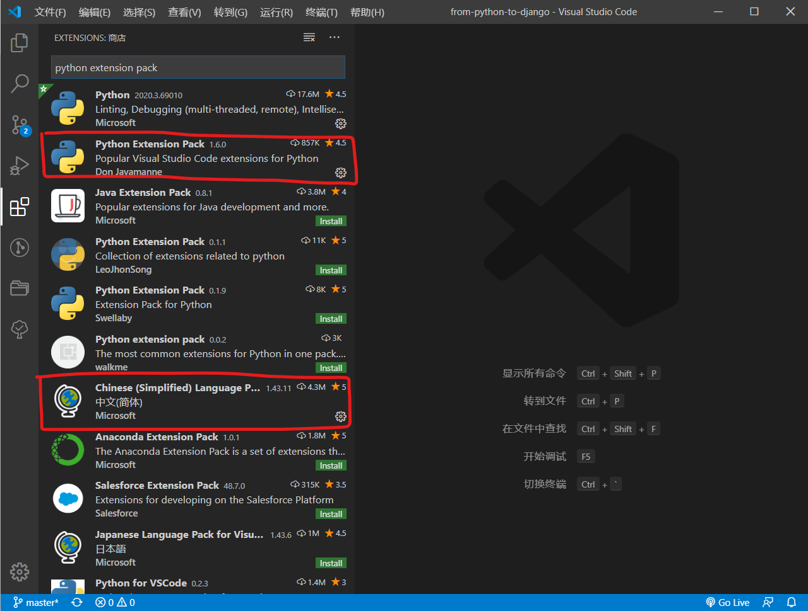
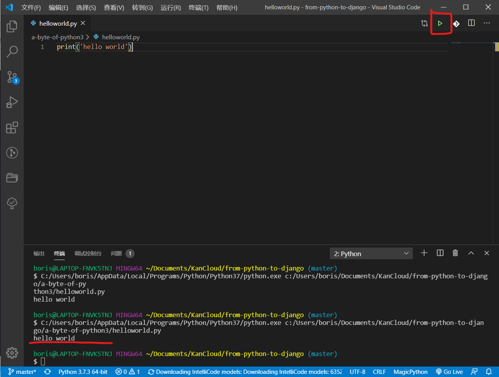
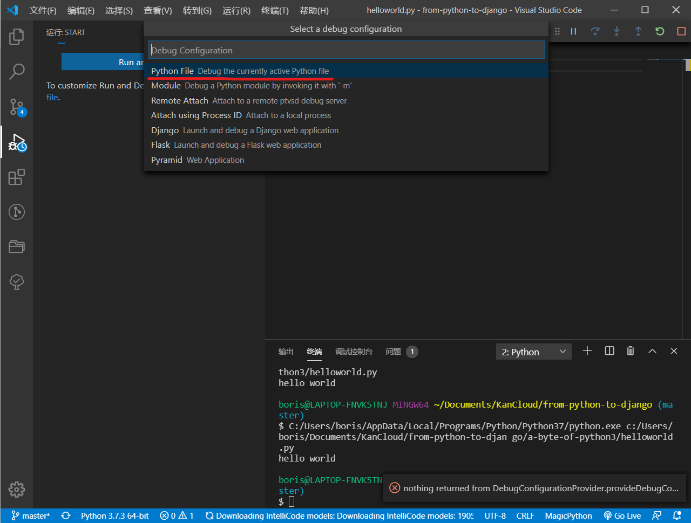
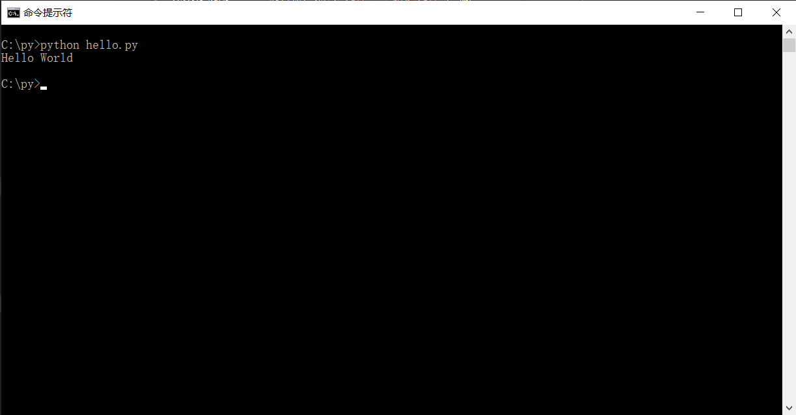

# 第一步

现在,我们将看到在Python中如何运行一个传统的“Hello World”程序。这将教你如何写、保存和运行Python程序。

使用Python运行你的程序有两种方法——使用交互式解释器提示符或使用一个源文件。现在,我们将看到如何使用这两种方法。

## 使用解释器提示符

在您的操作系统中打开终端(如前面[安装](a-byte-of-python3/install.md)所述),然后，输入`python3`按回车键，打开Python提示符。

一旦你启动python 3,您应该看到`>>>`,这被称为 _Python解释器提示符_，你可以开始输入Python程序。

在Python解释器提示符下，输入

```python
print("Hello World")
```

然后按回车键。您应该看到输出了单词`Hello World`。

下面我们使用Win10电脑举个例子。不同的电脑上Python软件会有一些细节的差异，但从提示符(即从`>>>`开始)，各个操作系统显示一致。

```python
C:\>python
Python 3.7.6 (tags/v3.7.6:43364a7ae0, Dec 19 2019, 00:42:30) [MSC v.1916 64 bit (AMD64)] on win32
Type "help", "copyright", "credits" or "license" for more information.
>>> print('Hello World')
Hello World
>>>
```

注意,Python让你的代码行立即输出了!你刚才输入的是一个Python _语句_。我们使用`print`输出你提供给它的任何值。在这里，我们提供的是文本`Hello World`，并立即打印到屏幕上。

### 如何退出解释器提示符

如果你正在使用一个GNU/Linux或MaxOS shell，您可以通过按下`[ctrl + d]`或输入`exit()`(注意:记得包含括号,`()`)，然后输入回车键。

如果您使用的是Windows命令行提示符,按`[ctrl + z]`键再按回车键，退出解释器提示符。

## 选择一个编辑器

我们不能在每次想要运行一些东西的时候都要在解释器提示符下输入我们的程序，所以我们必须把它们保存为文件，这样我们可以任意地运行我们的程序。

要创建我们的Python源文件,我们需要一个可以输入并保存它们的编辑软件。一个优秀的程序员的编辑器将使你写源代码文件变得更容易。因此，选择一个编辑器确实至关重要。你必须选择一个编辑器，就像你选择要买的汽车一样。一个好的编辑器会使您编写Python程序更加容易。就像一辆好车，在旅途中可以让你更快、更安全、更舒适地到达目的地。

一个非常基本的需求是 _语法高亮显示_，分别以不同的颜色显示你Python程序的不同部分，以便您可以看到你的程序且使其运行可视化。

如果你不知道从哪里开始，我推荐可以在Windows、Mac OS X和GNU/Linux上使用的[Visual Studio Code](https://code.visualstudio.com/)(简称VSCode)免费软件与Python插件(ext install python)。

如果您使用的是Windows，*不要使用记事本*——这是一个糟糕的选择，因为它不做语法高亮显示，而且更重要的是它不支持文字的缩进——之后我们在我们的例子中会看到，缩进是非常重要的。好的编辑器如Komodo Edit会自动地做到这一点。

如果你是一名有经验的程序员，那么你一定已经使用过[Vim](http://www.vim.org/)或[Emacs](http://www.gnu.org/software/emacs/)了。不用说，这是两个最强大的编辑器，使用它们来写你的Python程序，你会从中受益。就我自己而言，在我的大多数项目,甚至写一[整本书都在用Vim](http://www.swaroopch.com/notes/vim)。

从长远来看Vim或者Emacs是非常有用的，如果你愿意花时间去学习，那么我强烈建议你使用它们。然而，正如我之前提到的，初学者可以从VSCode开始学习Python而不是编辑器。

再次重申，请选择一个适当的编辑器，它可以使编写Python程序更有趣和更容易。

## VSCode（原文推荐[PyCharm教育版](https://www.jetbrains.com/pycharm-edu/)，考虑到这个版本功能不完整，完整功能的专业版要收费，本文推荐VSCode）

[Visual Studio Code](https://code.visualstudio.com/)是一个免费的集成开发环境（IDE），你可以用它开发Python程序。

下载安装之后，在菜单中选择`查看`->`扩展`，然后输入`python extension pack`，安装下面两个扩展：

* 由`Don Jayamanne`开发的`Python Extension Pack`
* 由`Microsoft`开发的`Chinese (Simplified) Language Pack`



就完成了开发环境的配置

在VSCode中，项目就是文件夹，你可以使用资源管理器新建一个文件夹，然后在VSCode中使用菜单项`文件`->`打开文件夹...`打开这个文件夹。

打开文件夹之后，使用菜单项`文件`->`新建文件`创建一个新的文件，VSCode默认会给文件起名`Untitled-1`，选择`文件`->`保存`将文件保存在当前项目文件夹下面，命名为`helloworld.py`，就完成了第一个Python源文件的创建。

在编辑器中输入以下代码：

```python
print("hello world!")
```

点击`[Ctrl+S]`保存文件之后，点击右上角的绿色小三角，就可以运行`helloworld.py`程序了。



再次点击绿色的小三角按钮，会看到程序没有立即运行，而是进入了调试状态，在中间出现了调试的对话框，点击那个绿色的小三角按钮即可运行程序，看到`hello world!`的输出。

上面的运行方式只可以运行Python程序，不能进行调试。为了调试我们需要为Python项目创建一个`launch.json`文件，使用菜单项`查看`->`运行`，点击`create a launch.json file`，然后在弹出的对话框里选择`Python File`，就可以创建一个`launch.json`文件。有了这个文件，我们可以在左侧的`运行`选项卡里，点击绿色的小三角调试运行我们的Python程序，注意要保持helloworld.py是当前打开的文件状态。



## Vim

1. 安装[Vim](http://www.vim.org)
    * Mac OS X用户应该通过[HomeBrew](https://brew.sh/)安装`macvim`软件 。
    * Windows用户应该在[Vim网站](https://www.vim.org/download.php)下载exe安装文件。
    * GNU/Linux用户一般情况下可以直接使用`vim`。
2. 你可以安装[jedi-vim](https://github.com/davidhalter/jedi-vim)这个插件为vim增加自动完成的功能。
3. 安装对应的`jedi`python包 : `pip install -U jedi`

## Emacs

1. I安装[Emacs 24+](https://www.gnu.org/software/emacs/).
    * Mac OS X用户从[https://emacsformacosx.com/](https://emacsformacosx.com/)获得emacs
    * Windows用户从[https://ftp.gnu.org/gnu/emacs/windows/](https://ftp.gnu.org/gnu/emacs/windows/)下载
    * GNU/Linux用户根据不同的发行版获得对应的emacs软件，比如Debian和Ubuntu用户可以安装`emacs24`软件包
2. 安装[ELPY](https://elpy.readthedocs.io/en/latest/)

## 使用一个源文件

现在让我们回归正题-编程。每当你学习一种新的编程语言时，有一个传统，你编写和运行的第一个程序是“Hello World”程序。当你运行它时，它所做的只是说“Hello World”。正如Simon Cozens(神奇的"Beginning Perl"的作者)所说，这是“向编程神祈求帮你更好学习语言的传统咒语。”

打开你选择的编辑器，输入以下程序并将其保存为“hello.py’。

如果你使用VSCode编辑器，点击`文件`->`新建文件`，输入:

```python
print('Hello World')
```

在VSCode编辑器，选`文件`->`保存`保存文件。

Python文件保存在哪里？任意文件夹都可以。如果你还不清楚，你可以创建一个新文件夹，并使用这个文件夹保存和运行你所有的Python程序:

- `C:\py` 在Windows上
- `/tmp/py` 在Linux上
- `/tmp/py` 在Mac OS X上

使用'mkdir'命令在命令行创建一个文件夹，例如，`mkdir C:\py`。

重要提示：确保你的Python文件扩展名是`.py`，例如，`foo.py`。

运行你的Python程序:

1. 打开一个命令行窗口。
2. **进入**你刚才保存文件的目录，例如：`cd C:\py`。
3. 键入`python hello.py`运行python程序，输入如下：

```shell
C:\py> python hello.py
hello world
```



如果你得到了如上所示的输出结果，那么祝贺你!你已经成功地运行了你的第一个Python程序。您已经成功地越过学习编程最难的部分－－开始你的第一个程序!

如果你得到了一个错误，请 _准确_ 输入上面的程序，并且再次运行。注意，Python是区分大小写的，即`print`并不等于`Print`。前者是小写字母`p`和后者是大写字母`P`。同样，确保每一行的第一个字母之前没有空格或制表符——之后我们将继续阐述为什么这很重要。

**它是如何工作的**

Python程序是由 _语句_ 组成，在我们的第一个程序中，我们只有一个语句，在这个语句中，我们使用了`print` _语句_，它只是打印文本`Hello World`。

## 获得帮助

如果您需要快速获取任何的Python函数或语句的信息，那么您可以使用内置的`help`(帮助)功能。这是非常有用的，尤其是当使用命令行提示符时，例如，运行`help(len)`——这将显示`len`函数的帮助－－用于计算对象包含了多少元素。

注意：按`q`退出帮助

类似地,您可以获得Python中几乎任何事情的信息，使用`help()`去学习更多关于使用`help`本身的信息!

如果你需要获取操作符例如如`return`的帮助，那么你只需要把这些放到引号内部，如`help('return')`，Python就可以清楚的了解我们想做的事情。

## 总结

现在，你可以自由自在地编写、保存和运行Python程序了。

既然你是一名Python用户，让我们学习一些Python概念。
