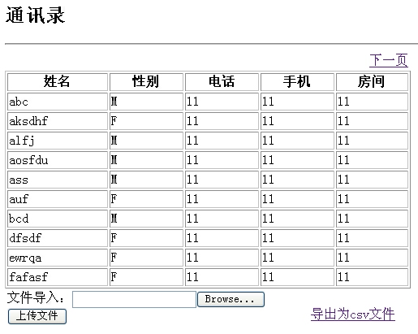
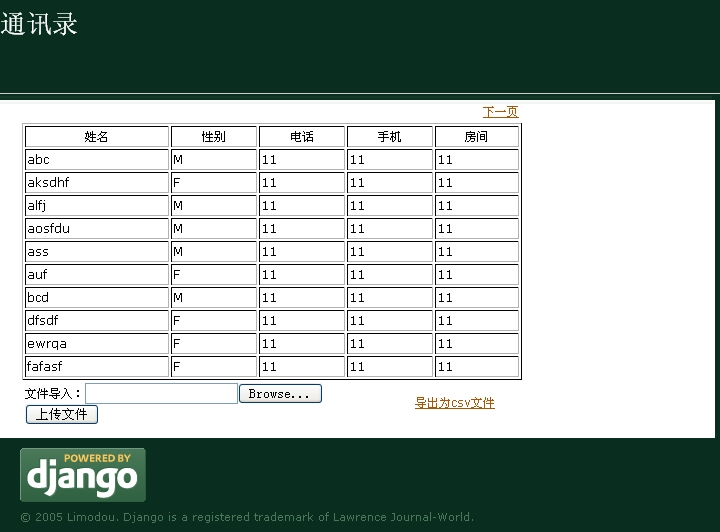

# Django Step by Step (九)

## 1 引言

不知道大家有没有对这个通讯录感到厌烦了，希望没有，因为还有一些东西没有讲完呢。

最让我感觉不满意的就是通讯录的显示了，的确很难看，希望可以美化一下。那么主要从这几方面：

* 对姓名进行排序 
* 生成分页结果 
* 增加css和一些图片

## 2 修改 address/models.py 实现排序

可以在 model 中增加一个叫 `Meta` 的内类，然后通过对其设置类属性可以用来控制 model 的模型属性。如我们想实现表的排序，可以在 `Meta` 中增加一个 `ordering = ['name']` 的属性即可。它表示按 `name` 进行排序。它可以有多个字段。如果在字段前加'-'表示倒序。修改完毕在浏览器中看一下效果就知道了。models.py的代码如下：

```python
from django.db import models

# Create your models here.

class Address(models.Model):
    name = models.CharField('姓名', max_length=20, unique=True)
    gender = models.CharField('性别', choices=(('M', '男'), ('F', '女')),
        max_length=1)
    telphone = models.CharField('电话', max_length=20)
    mobile = models.CharField('手机', max_length=11)
    room = models.CharField('房间', max_length=10, default='')

    def __str__(self):
        return self.name

    class Meta:
        ordering = ["name"]
```

## 3 修改 templates/address/address/list.html 实现分页显示

```html
<html>
<head>
</head>
<body>
  <h1 id="title">通讯录</h1>
  <hr>
  <div>
    
    <table border="0" width="500">
      <tr align="right">
        <td>
          
          <a href="/address?page={{ page_obj.previous_page_number }}">上一页</a>
           
          
          <a href="/address?page={{ page_obj.next_page_number }}">下一页</a>
          
        </td>
      </tr>
    </table>
    
    <table border="1" width="500">
      <tr>
        <th>姓名</th>
        <th>性别</th>
        <th>电话</th>
        <th>手机</th>
        <th>房间</th>
      </tr>
      
      <tr>
        <td>{{ person.name }}</td>
        <td>{{ person.gender }}</td>
        <td>{{ person.telphone }}</td>
        <td>{{ person.mobile }}</td>
        <td>{{ person.room }}</td>
      </tr>
      
    </table>
  </div>
  <table border="0" width="500">
    <tr>
      <td>
        <form enctype="multipart/form-data" method="POST" action="/address/upload/">
          文件导入：
          <input type="file" name="file" />
          <br/>
          <input type="submit" value="上传文件" />
        </form>
      </td>
      <td>
        <p>
          <a href="/address/output/">导出为csv文件</a>
        </p>
      </td>
    </tr>
  </table>
</body>
</html>
```

这时我仍然使用的是 generic view 来处理。但对布局作了简单的调整，将导入和导出的内容移到下面去了。同时增加了对分页的支持:

```html

<a href="/address?page={{ page_obj.previous_page_number }}">上一页</a>
 

<a href="/address?page={{ page_obj.next_page_number }}">下一页</a>

```

在使用 generic view的 `object_list` 时，它会根据 URL Dispatch 中是否设置了 `paginate_by` 这个参数来决定是否使用分页机制。一会我们会看到在 `urls.py` 的这个参数。一旦设置了这个参数，则 `object_list` 会使用 Django 提供的一个分页处理器来实现分页。它会自动产生分页所用到的许多的变量，这里我们使用了 `has_previous`, `previous`, `has_next`, `next` 这四个变量，还有其它一些变量可以使用。具体的参见 [Generic views](https://docs.djangoproject.com/en/1.11/topics/class-based-views/generic-display/) 文档。

这里是根据是否有前一页和下一页来分别生成相应的链接。对于分页的链接，需要在url中增加一个 Query 关键字 `page` 。因此我的模板中会使用 `page={{ previous }}` 和 `page={{ next }}` 分别指向前一页和下一页的页码。

## 4 修改address/views.py

```python
class IndexView(generic.ListView):
    model = Address
    template_name = 'address/list.html'
    paginate_by = 2
```

我们为`IndexView`类增加一个成员变量：`paginate_by`，指定每一页显示2条记录。


## 5 启动 server 测试

显示效果为



下面让我们为它添加一些CSS和图片，让它变得好看一些。

首先要说明一下，我们一直处于开发和测试阶段，因此我们一直使用的都是 Django 自带的 server(其实我个人感觉这个 server 的速度也挺快的)，但最终我们的目的是把它部署到 Apache 上去。现在我们打算增加 CSS 和添加一些图片， Django 提供了这个能力，这就是对静态文件的支持，但是它只是建议在开发过程中使用。真正到了实际环境下，还是让专门的 web server 如 Apache 来做这些事情。只要改一下链接设置就好了。更详细的说明要参见 [Managing static files](https://docs.djangoproject.com/en/1.11/howto/static-files/) 的文档。同时在 Django 中为了不让你依赖这个功能，特别在文档的开始有强烈的声明：使用这个方法是低效和不安全的。同时当 `DEBUG` 设置(在 `settings.py` 中有这个选项， `True` 表示处于调试期，会有一些特殊的功能)为 `False` 时，这个功能就自动无效了，除非你修改代码让它生效。

## 6 修改 urls.py

```python
from django.conf import settings
from django.conf.urls.static import static

urlpatterns = [
    # ... 其他的URL Pattern ...
] + static(settings.STATIC_URL, document_root=settings.STATIC_ROOT)
```

我们使用static函数，它需要两个参数。第一个参数是通过URL访问静态文件时的相对路径，在`settings.py`文件中默认设置为`STATIC_URL = '/static/'`，也就是通过`http://yourhost/static/`访问静态文件；第二个参数是静态文件在服务器上存放的路径，`STATIC_ROOT` 就是我将用来存放 CSS 和图片的地方，这里我使用了一个 `STATIC_PATH` ，它从哪里来呢？它是我自已在 `settings.py` 中定义的。在前面有一个导入语句:

```python
from django.conf import settings
```

从这里可以看到是如何使用 settings.py 的，我们完全可以自已定义新的东西，并让它在整个项目中生效。

## 7 修改 settings.py

在最后增加:

```python
STATIC_ROOT = os.path.join(BASE_DIR, "collect_static/")

STATICFILES_DIRS = [
    os.path.join(BASE_DIR, "static"),
]
```

STATIC_ROOT这个字段的的目录路径是用来为部署而收集静态文件的地方。
更具体的说呢，当我们执行`python manage.py collectstatic`命令的时候，系统会帮我们把所有的静态文件都收集到该目录下。
STATICFILES_DIRS默认是一个空列表，那么这个设置定义了staticfiles app将会遍历的一个附加的位置信息。该值应该设置为一个字符串的列表形式，每个元素都是附加文件目录的绝对路径。
> 注意：这些路径都应该使用unix风格的斜杠，即便是在windows平台上("C:/Users/user/mysite/extra_static_content")

那么我需要在 `newtest` 目录下创建一个 `static`和`collect_static` 的目录。

## 8 创建 newtest/static 目录

这样根据上面 `urls.py` 的设置，我们以后将通过 `/static/XXX` 来使用某些静态文件。

为了美化，我想需要一个 CSS 文件来定义一些样式，同时我还想提供一个 Django Powered 的图片。 [在这里有官方提供的图标](http://www.djangoproject.com/community/badges/) 。 于是我下了一个放在了 `static` 目录下。同时 CSS 怎么办，自已重头写，太麻烦，反正只是一个测试。于是我下载了 Django 站点用的 css 叫 `base.css` 也放在了 `static` 下面。下面就是对模板的改造。

> 在 SVN 中我放了一个 css 和 gif 图片大家可以使用，不然可能看不出效果。

为了通用化，我新增了一个 `base.html` 它是一个框架，而以前的 `address/list.html` 是它的一个子模板。这样我们就可以了解如何使用模板间的嵌套了。

## 9 创建 newtest/templates/base.html

```html
<!DOCTYPE html PUBLIC "-//W3C//DTD XHTML 1.0 Transitional//EN"
    "http://www.w3.org/TR/xhtml1/DTD/xhtml1-transitional.dtd">
<html xmlns="http://www.w3.org/1999/xhtml" xml:lang="en" lang="en">
    <head>
        <meta http-equiv="Content-type" content="text/html; charset=utf-8" />
        <meta http-equiv="Content-Language" content="en-us" />

        <title>Address</title>

        <meta name="ROBOTS" content="ALL" />
        <meta http-equiv="imagetoolbar" content="no" />
        <meta name="MSSmartTagsPreventParsing" content="true" />
        <meta name="Copyright" content="This site's design and contents Copyright (c) 2005  Limodou." />

        <meta name="keywords" content="Python, Django, framework, open-source" />
        <meta name="description" content="Django is a high-level Python Web framework that encourages rapid development and clean, pragmatic design." />

        <link href="/static/base.css" rel="stylesheet" type="text/css" media="screen" />

    </head>

    <body>
        <div id="container">
            content
        </div>
        <div id="footer">
            <div>
            
            </div>
            <p>&copy; 2005 Limodou. Django is a registered trademark of Lawrence Journal-World.</p>
        </div>
    </body>
</html>
```

有些代码也是从 Django 的网页中拷贝来的。特别要注意的是:

```python
content
```

这样就是定了一个可以扩展的模块变量块，我们将在 `address/list.html` 中扩展它。同时对 CSS 和 Django-Powered 的图片引用的代码是:

```html
<link href="/static/base.css" rel="stylesheet" type="text/css" media="screen" />

```

前面都是从 `static` 开始的。这样就将使用我们前面在 `urls.py` 中的设置了。

## 10 修改 templates/address/address/list.html

```html


<style type="text/css">
  h1#title {
    color: black;
  }
</style>
<div id="header">
  <h1 id="title">通讯录</h1>
</div>
<hr>
<div>
  
  <table border="0" width="500">
    <tr align="right">
      <td>
        <a href="/address?page={{ page_obj.previous_page_number }}">上一页</a>
         
        <a href="/address?page={{ page_obj.next_page_number }}">下一页</a>
        </td>
    </tr>
  </table>
  
  <table border="1" width="500">
    <tr>
      <th>姓名</th>
      <th>性别</th>
      <th>电话</th>
      <th>手机</th>
      <th>房间</th>
    </tr>
    
    <tr>
      <td>{{ person.name }}</td>
      <td>{{ person.gender }}</td>
      <td>{{ person.telphone }}</td>
      <td>{{ person.mobile }}</td>
      <td>{{ person.room }}</td>
    </tr>
    
  </table>
</div>
<table border="0" width="500">
  <tr>
    <td>
      <form enctype="multipart/form-data" method="POST" action="/address/upload/">
        文件导入：
        <input type="file" name="file" />
        <br/>
        <input type="submit" value="上传文件" />
      </form>
    </td>
    <td>
      <p>
        <a href="/address/output/">导出为csv文件</a>
      </p>
    </td>
  </tr>
</table>

```

基本上没有太大的变化，主要是增加了一些 `div` 标签，同时最开始使用:

```html

```

表示是对 base 的扩展，然后是相应的块的定义:

```html

...

```

注意，所有扩展的东西一定要写在块语句的里面，一旦写到了外面，那样就不起作用了。

Django 的模板可以不止一次的扩展，但这里没有演示。

## 11 启动 server 测试

现在你看到的页面是不是象我这样？



## 12 重要的版权问题

版权是一个可能我们大多数人都不重视的问题，但在实际生产中，这是一个必须重视的问题。许多东西象CSS,图片，甚至可能是一种布局，设计都有可能有版权，在使用这些东西的时候一定要注意相关的说明。不要给自已造成麻烦。如果你不清楚，建议你去找清楚的人，或与所有者联系。特别是对于开源，版权更是一个很重要的东西，因为这是保护我们的武器，希望每个人都重视。特别是对于正式发布的东西，一定要将版权问题交待清楚。